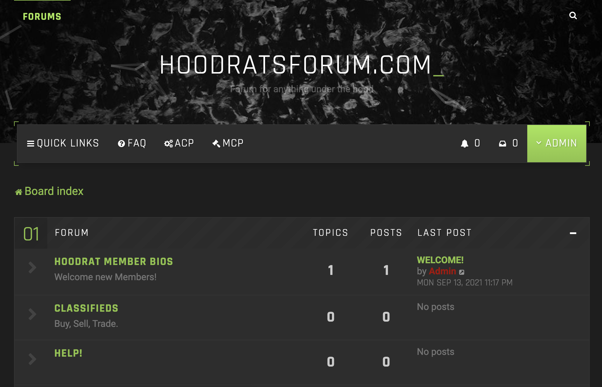

# `Auto Junkies`

Auto Junkies is a subdivision of HoodRats Forum. Its primary purpose is to allow Users to post help adds and connect with Providers on a client and provider level so that they may arrange diagnosis and repairs outide of the Forum network.

---



---

## Structure

---

- Home page lists options to sign in as User or Provider.
- Home page is just that. On the top of the page you will see a nav bar which will allow you to navigate through the different pages that the site has to offer... but be aware, you will need to sign up in order to navigate past the sign in page

---

### User Model

---

- Once logged in, Users will be able to navigate through their profile and edit their information. Users will also be able to create adds on a separate tab.

---

### Provider Model

---

- Once logged in, Providers will be able to review Users posts so that they may express interest in their capability of completing the job in which the User posted. The Provider will not have access to view other providers, only users posts. Once the provider deems they are confident of the repair, they may express interest by "commenting" on the add which will allow the user to get into contact with them.

---

### languages + Dependencies

---

- Node.js
- Axios
- Bcrypt
- Connect-flash
- Dotenv
- Ejs
- Express-ejs-layouts
- Express-session
- Passport
- Passport-local
- Sequelize
- Sequelize-cli
- DB = PostgreSQL

---

### Models - Providers

- ```js
  Module.exports = (sequelize, DataTypes) => {
    class Provider extends Model {
      static associate(models) {}
    }
    Provider.init(
      {
        name: {
          type: DataTypes.STRING,
          validate: {
            len: {
              args: [1, 99],
              msg: "Name must be between 1 and 99 characters",
            },
          },
        },
        email: {
          type: DataTypes.STRING,
          validate: {
            isEmail: {
              msg: "Invalid email",
            },
          },
        },
        password: {
          type: DataTypes.STRING,
          validate: {
            len: {
              args: [8, 99],
              msg: "Password must be between 8 and 99 characters",
            },
          },
        },
      },
      {
        sequelize,
        modelName: "Provider",
      }
    );
  ```
  ***

### Models - Users

- ```js
  module.exports = (sequelize, DataTypes) => {
    class User extends Model {
      static associate(models) {
      }
    }
    User.init(
      {
        name: {
          type: DataTypes.STRING,
          validate: {
            len: {
              args: [1, 99],
              msg: "Name must be between 1 and 99 characters",
            },
          },
        },
        email: {
          type: DataTypes.STRING,
          validate: {
            isEmail: {
              msg: "Invalid email",
            },
          },
        },
        password: {
          type: DataTypes.STRING,
          validate: {
            len: {
              args: [8, 99],
              msg: "Password must be between 8 and 99 characters",
            },
          },
        },
      },
      {
        sequelize,
        modelName: "User",
      }
    );
  ```

---

### Blockers

---

- Getting both profiles separated was hard... One main thing that was fighting me in the beginning was using passport. Passport would not recognize the provider so I separated both like below...

```js
//Provider//
providerRouter.post(
  "/login",
  passport.authenticate("provider-local", {
    successRedirect: "/",
    failureRedirect: "/provider/login",
    successFlash: "Welcome back ...",
    failureFlash: true,
  })
);

//User//
userRouter.post(
  "/login",
  passport.authenticate("user-local", {
    successRedirect: "/",
    failureRedirect: "/user/login",
    successFlash: "Welcome back ...",
    failureFlash: true,
  })
);
```

THEN, this didnt work, so I reverted back and made the provider and user the same model, with added conditions like below:

```js
provider: {
        type: DataTypes.BOOLEAN,
        defaultValue: false,
      },
      providerNumber: {
        type: DataTypes.STRING,
      },
```

---

### Installation

- Open iTerm and navigate to a folder in which you would like to install this app.
- Clone repository ( git clone https://github.com/rest2437/auto-junkies.git )
- Open file in VScode ( code . )
- Open Terminal in VScode ( contol backtick )
- Install Sequelize ( npm install sequelize-cli -g )
- Install all dependencies ( npm install )
- Create DB ( sequelize db:create )
- Migrate DB (sequelize db:migrate )
- Create .env file and copy and paste this secret session : SECRET_SESSION=alldayidreamaboutsoftwareengineering
- Run ( npm run start ) and enjoy!
